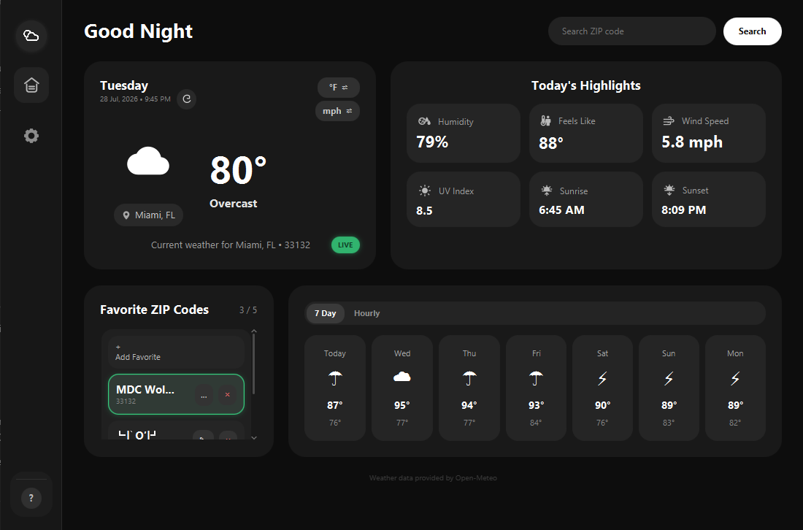

# Weather Dashboard - By Pablo Gallardo

**Version 1.0 — Mostly Sunny**

Weather Dashboard is a native JavaFX desktop application that retrieves current weather information and forecasts using a U.S. ZIP code. It combines a polished graphical interface with SQLite persistence, full CRUD operations for favorite locations, input validation, exception handling, unit conversion, and saved application settings.

## Application Screenshot

## Features

- Search for weather using a five-digit U.S. ZIP code
- Display the current temperature, weather condition, humidity, wind speed, UV index, feels-like temperature, sunrise, and sunset
- View seven-day and hourly forecasts
- Switch between Fahrenheit and Celsius
- Switch between miles per hour and kilometers per hour
- Save up to five favorite ZIP codes
- Select a favorite to reload its weather
- Rename saved favorites with custom names
- Delete individual favorites or reset the complete favorites list
- Persist favorites, unit preferences, theme, and startup settings with SQLite
- Optionally reload the last viewed ZIP code when the application starts
- Switch between dark and light themes
- Display loading, empty, LIVE, and OFFLINE states
- Show weather icon and terminology guides
- Provide a dedicated About screen and built-in Help guide
- Validate ZIP codes and prevent duplicate favorites
- Handle network, API, and database errors without crashing

## CRUD Operations

- Create: Add a ZIP code to favorites.
- Read: View the favorites saved in SQLite.
- Update: Rename a favorite.
- Delete: Remove one favorite or reset the list.

## Technologies Used

- Java 21 and JavaFX 21 with FXML and CSS
- Maven
- SQLite with JDBC
- Jackson and the Java HTTP Client
- JUnit 5
- Open-Meteo and Zippopotam.us
- IntelliJ IDEA

## How the Code Is Organized

Most of the program is inside `src/main`. I separated the Java classes by what
they are responsible for:

- `database` handles SQLite, saved favorites, and application settings.
- `model` contains the objects used to hold weather and forecast information.
- `service` sends the web requests and reads the weather data.
- `util` contains ZIP-code validation and unit conversions.
- `resources` contains the FXML layout, CSS design, and application icon.

The JUnit tests are under `src/test`. The project also includes `pom.xml` for
Maven dependencies and `weather-dashboard.db` for the saved SQLite data.

## Requirements

- Windows, macOS, or Linux
- JDK 21 or newer
- Maven, or the included Maven wrapper
- Internet connection for live weather information

No weather API key is required.

## Running the Project in IntelliJ IDEA

1. Clone or download the repository.
2. Open IntelliJ IDEA.
3. Select **Open** and choose the `WeatherDashboard` folder.
4. Allow IntelliJ to import the project as a Maven project.
5. Set the Project SDK to JDK 21 or newer.
6. Open `Launcher.java`.
7. Run the `main` method in `Launcher`.

The application automatically creates `weather-dashboard.db` if the database file does not already exist.

## Maven Commands

I used Windows for this project. From the project folder, the app can be started
with `.\mvnw.cmd clean javafx:run`.

The tests can be run with `.\mvnw.cmd test`. In IntelliJ, you can also
right-click the `src/test` folder and select **Run Tests**.

The current test suite verifies:

- Valid and invalid ZIP code inputs
- Empty and null ZIP values
- Fahrenheit-to-Celsius conversion
- Miles-per-hour-to-kilometers-per-hour conversion

Current result: **8 tests passed, 0 tests failed**.

## Database

The SQLite database contains:

- `favorite_locations` for saved ZIP codes and custom names
- `application_settings` for theme, unit, and startup preferences

The database is initialized automatically when the application launches.

## Input Validation and Error Handling

- ZIP codes must contain exactly five digits.
- Duplicate favorites are rejected.
- No more than five favorites can be saved.
- Invalid searches trigger visual feedback.
- Network and weather-service errors display user-friendly messages.
- Database errors are caught so the application can remain open.

## UI Inspiration

The interface was inspired by this [Weather Forecast Dashboard design on Figma Community](https://www.figma.com/community/file/1410567203716932869/weather-forecast-dashboard). I adapted the layout for my JavaFX desktop application and changed the controls and features to fit my project.

## Data Sources

Weather data is provided by [Open-Meteo](https://open-meteo.com/). U.S. ZIP code location information is provided by [Zippopotam.us](https://www.zippopotam.us/).
